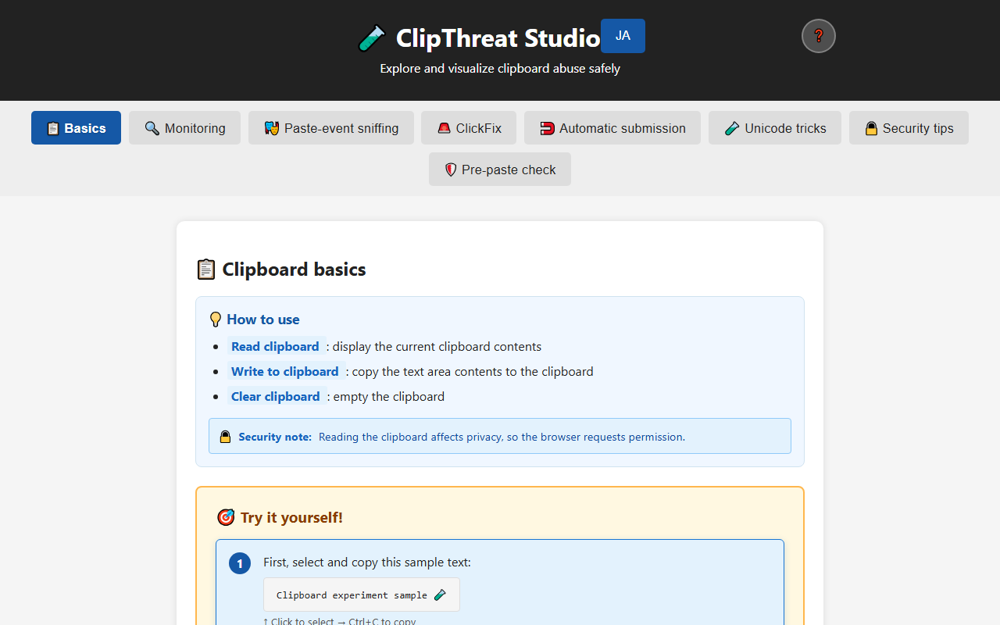
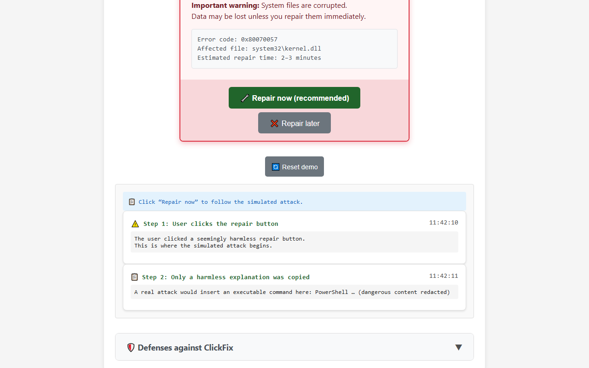
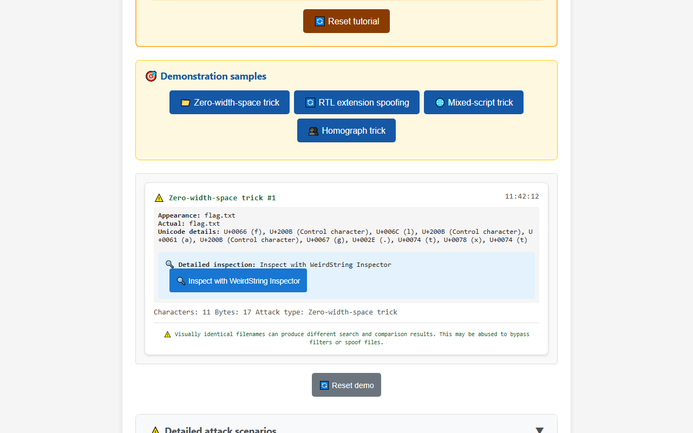
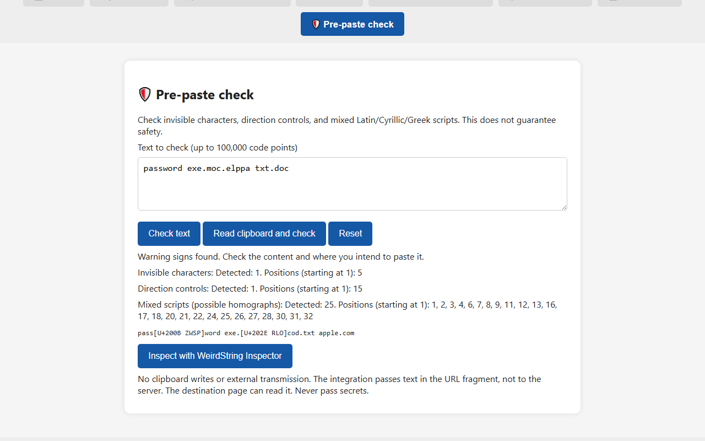

English · [日本語](README.md)

# ClipThreat Studio - Explore clipboard abuse safely


[](https://ipusiron.github.io/clipthreat-studio/)

**Day033 - 100 Security Tools with Generative AI**

**ClipThreat Studio** is an interactive educational tool that visualizes abuse of the JavaScript Clipboard API through safe demonstrations.

Its tabs cover reading, writing, paste monitoring, and ClickFix prompts, illustrating threats that combine psychological manipulation with technical abuse.

---

## 🌐 Demo

👉 [https://ipusiron.github.io/clipthreat-studio/](https://ipusiron.github.io/clipthreat-studio/)

---

## 📸 Screenshots

> 
>
> *Initial Basics tab in English (1280×800, 53,889 bytes)*

> 
>
> *Redacted display after copying only a harmless explanation (1280×800, 42,287 bytes)*

> 
>
> *Zero-width-space sample and code-point inspection (1280×800, 44,572 bytes)*

> 
>
> *Invisible characters, direction controls, and mixed scripts detected; controls shown as labels (1280×800, 42,933 bytes)*

Images 1–3 in the Japanese README show the first release. This English README shows the current English interface.

---

## 🎯 Features

### 📋 Basics tab

- Explore the basic behavior of `clipboard.readText()` / `.writeText()`.
- Understand clipboard operations and browser restrictions.
- Learn step by step through the tutorial.

### 🔍 Monitoring tab

- Automatically monitor clipboard contents and display a log.
- Detect clipboard changes in real time.
- Adjust the monitoring interval and inspect detailed logs.

### 🎭 Paste sniffing tab

- Demonstrate sniffing through paste events.
- Intercept content pasted into an input field.
- Learn how information may leak without the user noticing.

### 🚨 ClickFix tab

- Learn the risks of following fake repair prompts.
- Copy only a harmless explanation.
- Display commands in redacted form and clear the clipboard when the demo ends or resets.

### 🧲 Automatic submission tab

- Simulate a deceptive form that responds to pasted content with automatic submission.
- Explore the simulation in a developer-console-style interface.
- Follow a step-by-step tutorial and detailed explanations of defenses.

### 🧪 Unicode tricks tab

- Explore zero-width spaces, RTL characters, homographs, and other Unicode tricks.
- Try 4 individual patterns.
- Open WeirdString Inspector for detailed Unicode analysis.
- Examine results and actual code points.

### 🔒 Security tips tab

- Read a comprehensive defense guide and best practices.
- Browse information organized into illustrated categories.
- Review your own practices with security checklists.

### 🛡️ Pre-paste check tab

- Inspect manually entered text or read the clipboard on request. Never writes to the clipboard.
- Detect invisible characters, direction controls, and mixed Latin/Cyrillic/Greek scripts.
- Report counts and one-based code-point positions, up to 100,000 code points.
- Replace controls with visible labels such as `[U+202E RLO]`.
- Clear input and results on reset or tab departure; discard late results from pending reads.

### 🎛️ Shared features

- ❓ Detailed instructions through the help button.
- 📊 Timestamped demonstration results.
- 🔄 Reset demonstrations to repeat an exercise.
- 📱 Responsive layouts for mobile devices.
- 🌐 Switch between Japanese and English with the header button.

---

## 🛠️ Usage

### Basic workflow

1. **Open the tool:** clone this repository or visit the [GitHub Pages demo](https://ipusiron.github.io/clipthreat-studio/).
2. **Read help:** open the ❓ button in the header for detailed instructions.
3. **Switch tabs:** explore different attack techniques.
4. **Follow tutorials:** work through the steps in each tab.
5. **Inspect results:** review operation results and logs.
6. **Learn defenses:** visit Security tips for background and prevention.

### Suggested learning order

1. **📋 Basics** → understand the Clipboard API.
2. **🔍 Monitoring** → explore automatic monitoring.
3. **🎭 Paste sniffing** → learn about paste-event risks.
4. **🚨 ClickFix** → explore psychological manipulation.
5. **🧲 Automatic submission** → understand automated data-leak risks.
6. **🧪 Unicode tricks** → recognize the complexity of Unicode spoofing.
7. **🔒 Security tips** → study comprehensive defenses.
8. **🛡️ Pre-paste check** → inspect the actual characters before pasting.

## 🌐 Language selection

Use “English” or “JA” in the header. Language precedence is the URL parameter `?lang=ja|en`, your saved selection, and then the browser language. Browsers using a language other than Japanese default to English. The tool still works when storage is unavailable.

Switching language resets demo input, results, and progress, and cancels pending work. Existing writing demos also clear the clipboard through their cleanup routines. Resetting or leaving the read-only Pre-paste check tab does not write to the clipboard. The selected language is saved and reflected in the URL.

---

## 🔍 WeirdString Inspector integration

After a demonstration in Unicode tricks, an **“🔍 Inspect with WeirdString Inspector”** button appears.

Pre-paste check offers the same integration with `attack_type=paste-check`.

### Destination URL format

The button opens WeirdString Inspector using this format:

```text
https://ipusiron.github.io/weirdstring-inspector/#text={sample_text}&source=clipthreat-studio&attack_type={attack_type}
```

### Parameters

| Parameter | Description | Example |
|-----------|-------------|---------|
| `text` | URL-encoded Unicode sample | `f%E2%80%8Bl%E2%80%8Ba%E2%80%8Bg.txt` |
| `source` | Identifier indicating ClipThreat Studio as the source | `clipthreat-studio` |
| `attack_type` | Demonstration type | `Zero-width-space trick` |

### Supported demonstration types

- **Zero-width-space trick:** insert characters that are not visually apparent.
- **RTL extension spoofing:** alter the apparent extension using right-to-left controls.
- **Mixed-script trick:** combine writing systems to support phishing.
- **Homograph trick:** spoof a domain using different characters with similar shapes.
- **Pre-paste check:** pass input under the identifier `paste-check`.

### Privacy when passing text

Text and demonstration type are placed in the URL fragment (`#text=`).
The fragment is not sent to the server in the HTTP request.
WeirdString Inspector supports these parameters.
The new tab opens with `noopener,noreferrer`.
JavaScript on the destination page can read the text, so never enter real secrets.

---

## 🧠 Educational uses

- Materials for security training and classes.
- Awareness demonstrations at exhibitions and seminars.
- Introductory training for CTF teams and red teams.
- Practical explanations of why autofill can be safer than manual copying.

---

## 🛡️ Security background

### Clipboard threat level

Clipboard attacks abuse everyday copying and pasting. Their danger is that users may not notice the attack, which can expose confidential information or cause unintended operations.

### 📋 Basic clipboard attack scenarios

#### Scenario 1: Password theft

If another page reads copied secrets, unintended exposure can follow. Review clipboard permissions for each site and use only fictional data in experiments.

**Example impact:** a password is stolen when the user copies it from a password manager.

#### Scenario 2: Cryptocurrency address replacement

After pasting a payment destination, compare the entire address with the original. Also consider clipboard history and synchronization to other devices.

**Example impact:** the destination is replaced with an attacker-controlled address and funds are stolen.

### 🎭 Paste-event monitoring attacks

#### How the attack works

A malicious website intercepts content pasted into an input field.

Page scripts can access pasted content even if the user never presses Submit. Administrators should review destination restrictions and the handling of input data.

### 🚨 How ClickFix works

#### Attack flow

1. **Fake error:** display a message such as “A system error occurred.”
2. **Repair prompt:** present a “Repair now” button.
3. **Clipboard injection:** place malicious content on the clipboard when the button is clicked.
4. **Execution prompt:** ask the user to execute it through PowerShell or a command prompt.

#### Defenses for users and administrators

Do not follow unexpected repair instructions or prompts to paste into an OS execution dialog. Close the page and contact official support. Administrators should monitor suspicious script execution and communicate approved response procedures. This tool stores no executable attack command; it displays only part of the appearance and a redaction.

### 🧪 Technical details of Unicode tricks

#### 1. Zero-width-space tricks

Zero-width characters are difficult to notice visually. Inspect character counts and code points. Normalization alone does not necessarily remove all invisible characters.

#### 2. RTL extension spoofing

Direction controls change the display order of filenames. Do not trust the apparent extension alone; inspect actual code points and the file format.

#### 3. Homographs and IDN spoofing

Characters from different writing systems can have similar shapes. Compare domains and identifiers with their legitimate spelling rather than judging only by appearance.

### 🧲 Defending against automatic submission

#### Attack scenario

Confidential data is sent externally as soon as a developer pastes debugging content.

Network activity may begin immediately after input or paste. Review the conditions that trigger transmission, its destination, and the data involved. Restrict unnecessary requests through CSP. This tool only simulates transmission visually and makes no actual request.

### 🛡️ Defenses and best practices

#### 1. Technical controls

- Implement Content Security Policy (CSP).
- Manage clipboard access permissions.
- Validate and sanitize input.
- Apply Unicode normalization where appropriate.

#### 2. User education

- Check content before copying or pasting.
- Avoid pasting into untrusted sites.
- Enable full filename display.
- Review clipboard history regularly.

#### 3. Organizational measures

- Provide security training.
- Establish incident-response plans.
- Configure log monitoring and alerts.
- Assess vulnerabilities regularly.

---

## 🧪 Tests

Run with Node 22 or newer. No dependency installation is needed.

```sh
npm test
```

GitHub Actions runs the same tests on push and pull_request events.
The tests also verify README tables, counts, and image references.

| Item | Count |
|---|---:|
| Learning tabs | 8 |
| Unicode copy samples | 4 |
| Tips checklists | 3 |
| Items in each checklist | 10 |
| Test files | 8 |

- `test/shared.test.js`: classification, escaping, Day023 fragment URLs, and redaction.
- `test/pastecheck.test.js`: detection table, boundaries, and safe display.
- `test/i18n.test.js`: dictionary keys, interpolation, language precedence, and static translation coverage.
- `test/safety.test.js`: harmless content, cancellation, and write ordering.
- `test/html.test.js`: CSP, modules, ARIA, and absence of inline execution.
- `test/contrast.test.js`: color contrast.
- `test/format.test.js`: line lengths and prevention of minification.
- `test/readme.test.js`: tables, counts, images, and directory trees.

The expected pre-paste results are listed below. Mixed-script detection counts only Latin, Cyrillic, and Greek, not CJK, digits, punctuation, or ordinary emoji. Invisible-character and direction-control warnings indicate presence, not malicious intent.

| Input | Invisible | Bidi | Mixed |
|---|---:|---:|---|
| Empty string | 0 | 0 | false |
| これはテストです。ClipThreat Studioで確認します123。 (Japanese-language sample) | 0 | 0 | false |
| Please paste your text here to check it. | 0 | 0 | false |
| https://example.com/path?a=1 | 0 | 0 | false |
| 了解です😀🙂👍 (Japanese-language sample) | 0 | 0 | false |
| U+0430 + pple.com | 0 | 0 | true |
| paypa + U+03BF | 0 | 0 | true |
| exe. + U+202E + cod.txt | 0 | 1 | false |
| pass + U+200B + word | 1 | 0 | false |
| Привет | 0 | 0 | false |

Invisible characters include U+00AD, U+180E, U+200B–U+200D, U+2060, U+FEFF, and U+E0000–U+E007F. Direction controls include U+200E, U+200F, U+202A–U+202E, and U+2066–U+2069. Emoji sequences containing ZWJ or tags also trigger the corresponding presence warning. Mixed-script counts and positions cover all Latin, Cyrillic, and Greek characters in a mixed string. “No issues found” only means that nothing in this detection scope was found.

## 🔒 Safety design and limitations

ClickFix copies only the following explanation in English:

“This is a ClipThreat Studio demo. No attack command has been written to the clipboard.”

The command preview is redacted, for example, “PowerShell … (dangerous content redacted)”.
The clipboard is cleared when ClickFix completes and when existing demos reset or lose their tab. The read-only Pre-paste check tab is excluded.
Reset cancels pending demo work so old results or clipboard writes do not reappear later.
If clearing fails because permission is denied or the API is unavailable, a visible live notice asks the user to clean up manually.

- No external transmission occurs, and input is not logged to the console.
- CSP permits only same-origin scripts and CSS, and `connect-src 'none'` blocks communication.
- No inline event handlers or style attributes are used.
- Dynamic input is rendered through `textContent` or HTML escaping.
- External links use `noopener noreferrer`; the page uses `no-referrer`.
- Tabs, accordions, and help are keyboard accessible. Layouts wrap from 320px and support reduced motion.

Clipboard clearing cannot be guaranteed after closing the browser or revoking permission.
This page cannot erase OS clipboard history or cloud-synchronized history.
Clearing the clipboard also discards its previous contents. Use only fictional data in experiments.
This page is not a destination for secrets.

`frame-ancestors` and `X-Frame-Options` require HTTP response headers, so they are not configured through meta elements.
The separate legacy `404.html` is outside this interface update.

## 📁 Directory structure

```text
clipthreat-studio/                 # Educational tool
├── .claude/                      # Existing development-assistance settings
│   └── commands/                 # Development commands
│       ├── annotate.md           # Annotation workflow
│       └── reload-workspace.md   # Workspace review workflow
├── .github/                      # GitHub configuration
│   └── workflows/                # Automated checks
│       └── test.yml              # Node 22 tests on push and pull requests
├── .gitignore                    # Git exclusions
├── .nojekyll                     # Disable Jekyll processing on Pages
├── 404.html                      # Existing error page
├── CLAUDE.md                     # Development rules and specifications
├── LICENSE                       # MIT license
├── README.md                     # Japanese documentation
├── README.en.md                  # Full English translation
├── assets/                       # Screenshots
│   ├── screenshot.png            # Initial Basics screen
│   ├── screenshot2.png           # Safe ClickFix redaction
│   ├── screenshot3.png           # Unicode inspection results
│   ├── screenshot4.png           # Pre-paste warnings and safe display
│   └── en/                       # English screenshots
│       ├── screenshot.png        # Initial Basics screen
│       ├── screenshot2.png       # ClickFix redaction
│       ├── screenshot3.png       # Unicode inspection results
│       └── screenshot4.png       # Pre-paste warnings and safe display
├── favicon.svg                   # Site icon
├── index.html                    # Eight-tab interface
├── js/                           # ES modules
│   ├── autopaste.js              # Display-only submission simulation
│   ├── clickfix.js               # Harmless copying and learning display
│   ├── clipboard.js              # Basic operations
│   ├── clipboard-access.js       # Ordered writes and cleanup
│   ├── clipthreat-messages.js     # Japanese dictionary and dynamic locale selection
│   ├── clipthreat-messages-en.js  # English dynamic dictionary
│   ├── clipthreat-ui-messages.js  # Bilingual static text and attributes
│   ├── i18n.js                   # Language switching and rendering
│   ├── main.js                   # Tabs, help, and event bindings
│   ├── pastecheck.js             # Read-only pre-paste inspection
│   ├── shared.js                 # DOM-free classification, URLs, and redaction
│   ├── sniff.js                  # Paste-event visualization
│   ├── tips.js                   # Security checklists
│   ├── ui.js                     # Class-based visibility controls
│   ├── watch.js                  # Permission-based monitoring
│   └── weirdchar.js              # Unicode samples and integration
├── package.json                  # Dependency-free test command
├── style.css                     # Colors, layout, and mobile support
└── test/                         # Node built-in tests
    ├── contrast.test.js          # Contrast checks
    ├── format.test.js            # Line-length and readability checks
    ├── html.test.js              # Structure and CSP checks
    ├── i18n.test.js              # Dictionary and translation coverage checks
    ├── readme.test.js            # Documentation, counts, and image checks
    ├── safety.test.js            # Safety and cleanup checks
    ├── pastecheck.test.js        # Detection and boundary checks
    └── shared.test.js            # Pure-logic checks
```

## 💻 Requirements

Use a browser supporting ES modules and the Clipboard API, served over HTTPS or localhost HTTP.
Opening directly with `file://` is unsupported. No build or dependency installation is required.

```sh
python -m http.server 8000 --bind 127.0.0.1
```

Open `http://127.0.0.1:8000/`.
Clipboard reading and writing depend on browser permissions and focus restrictions.

## 📄 License

MIT License. See [LICENSE](LICENSE) for details.

---

## 🛠️ About this tool

This tool is part of the “100 Security Tools with Generative AI” project. The project uses AI assistance to build and publish security-related tools over 100 days.

For project details and other tools, visit the following page (Japanese-language):

🔗 [https://akademeia.info/?page_id=42163](https://akademeia.info/?page_id=42163)
