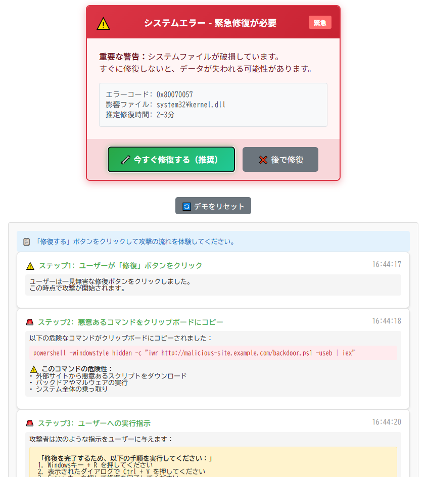

# ClipThreat Studio - クリップボード悪用攻撃の体験ツール


**Day033 - 生成AIで作るセキュリティツール100**

**ClipThreat Studio** は、JavaScriptによるクリップボードAPIの悪用手法を再現し、クリック1つで体験できる「クリップボード悪用攻撃の可視化＆体験ツール」です。

クリップボードに対する「読み取り」「書き込み」「paste監視」「ClickFix誘導」など、心理操作と技術的悪用を組み合わせた脅威を、複数タブ構成で体験できます。

---

## 🌐 デモページ

👉 [https://ipusiron.github.io/clipthreat-studio/](https://ipusiron.github.io/clipthreat-studio/)

---

## 📸 スクリーンショット

> 
>
> *ダミー*

---

## 🎯 特徴

- 📋 `clipboard.readText()` / `.writeText()` を体験できる操作パネル
- 🔍 クリップボード内容の自動監視・ログ表示
- 🎭 pasteイベントを使ったスニッフィング攻撃の再現
- 🚨 ClickFix攻撃（修復誘導型コピー攻撃）の完全再現
- 🧲 自動ペースト→自動送信型のフォーム偽装攻撃
- 🧪 不正制御文字の注入（ゼロ幅スペース、右から左文字など）
- 🔒 セキュリティTipsタブによる背景解説と対策

---

## 🛠️ 使い方

1. このリポジトリを `git clone` するか、上記のGitHub Pagesにアクセス
2. タブを切り替えて各攻撃手法を体験
3. 各操作に対して、コピーされた内容や挙動をログ表示
4. Tipsタブで技術的背景と防御法を確認

---

## 🧠 教育・啓発目的での活用例

- セキュリティ研修・授業の教材として
- 展示会・セミナーでの啓発デモツール
- CTFチームやRed Teamの新人教育用
- 「なぜオートフィルを使うべきか」の実感体験

---

## 🧩 フォルダー構成

```
clipthreat-studio/
├── index.html # タブUIと本体構成
├── script.js # 各タブの挙動制御
├── style.css # カードUI・警告色・タブ切替など
├── assets/ # 攻撃デモ用画像・アイコン等
└── README.md
```

---

## 📄 ライセンス

MIT License - 詳細は [LICENSE](LICENSE) をご覧ください。

---

## 🛠 このツールについて

本ツールは、「生成AIで作るセキュリティツール100」プロジェクトの一環として開発されました。 このプロジェクトでは、AIの支援を活用しながら、セキュリティに関連するさまざまなツールを100日間にわたり制作・公開していく取り組みを行っています。

プロジェクトの詳細や他のツールについては、以下のページをご覧ください。

🔗 [https://akademeia.info/?page_id=42163](https://akademeia.info/?page_id=42163)
